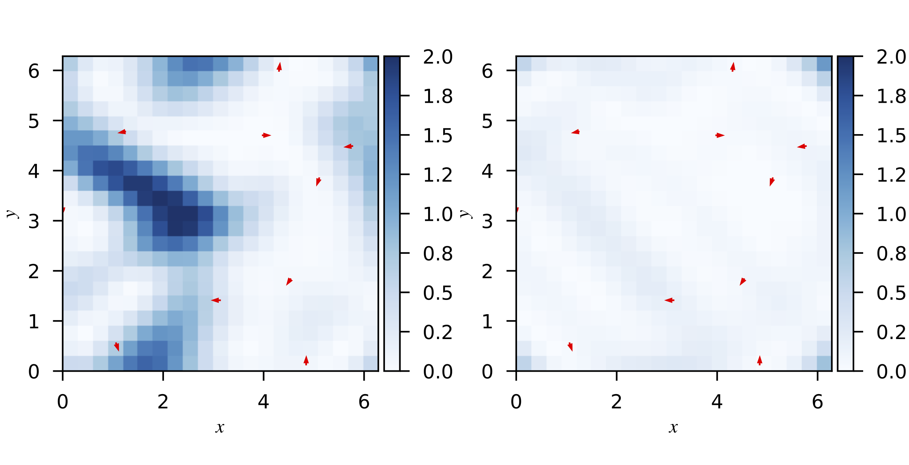

# Estimating divergence-free flows via neural networks

by Dmitry I. Kabanov, Luis Espath, Jonas Kiessling & Raul F. Tempone

This repo contains the paper based on the talk given at the
*91st Annual Meeting of the International Association of
Applied Mathematics and Mechanics*
([GAMM 2021](https://jahrestagung.gamm-ev.de/jahr2020-2021/)).

The paper is accepted for publication in the [Proceedings in Applied
Mathematics and Mechanics][1_].

DOI: [10.1002/pamm.202100173](https://doi.org/10.1002/pamm.202100173)

 > We apply neural networks to the problem of estimating divergence-free velocity
 > flows from given sparse observations. Fol- lowing the modern trend of combining
 > data and models in physics-informed neural networks, we reconstruct the
 > velocity flow by training a neural network in such a manner that the network
 > not only matches the observations but also approximately satisfies the
 > divergence-free condition. The assumption is that the balance between the two
 > terms allows to obtain the model that has better prediction performance than a
 > usual data-driven neural network. We apply this approach to the reconstruction
 > of truly divergence-free flow from the noiseless synthetic data and to the
 > reconstruction of wind velocity fields over Sweden.


**Comparison of prediction errors for two models.** Left: without divergence-free regularization. Right: with divergence-free regularization.

## Citation

To cite the article, please use the following BibTeX data:

```
@Article{KabanovEtAl2021a,
  author  = {Kabanov, Dmitry I. and Espath, Luis and Kiessling, Jonas and Tempone, Raul},
  journal = {Proceedings in Applied Mathematics \& Mechanics},
  title   = {Estimating divergence-free flows via neural networks},
  year    = {2021},
  doi     = {10.1002/pamm.202100173},
}
```

## LICENSE

The manuscript text is not open source. The authors reserve the rights to the
article content.
See [LICENSE](LICENSE).

[1_]: https://www.wiley.com/en-us/Proceedings+in+Applied+Mathematics+%26+Mechanics-p-9780JNRL01713
